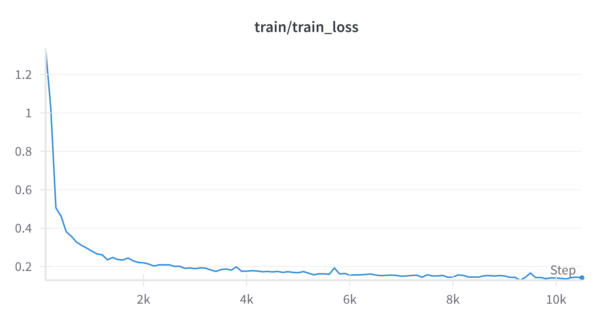
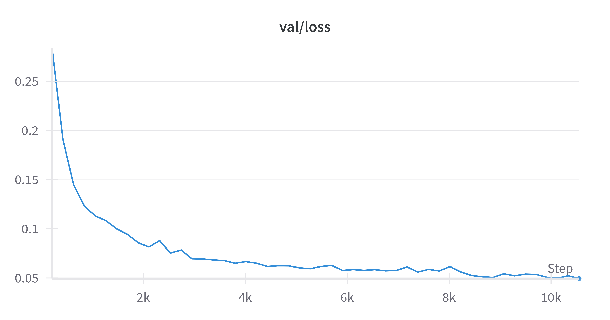
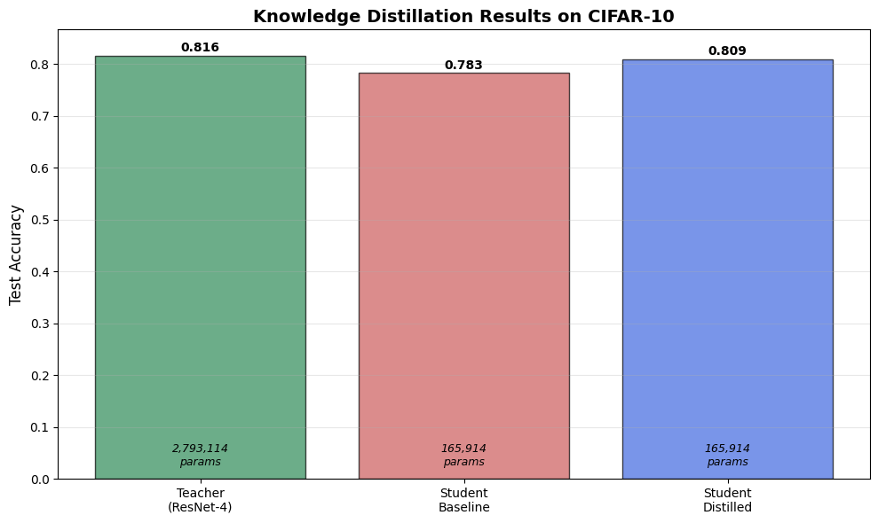

# Deep Learning Applications - Laboratory 1

## Overview

This laboratory focuses on implementing and comparing various neural network architectures, from simple MLPs to more complex CNNs with residual connections, using PyTorch. The experiments are designed to verify key principles in deep learning, particularly the benefits of residual connections and knowledge distillation techniques.

## Training Pipeline and Infrastructure

The laboratory implements a comprehensive training infrastructure built around a modular and extensible architecture. The core components include:

### Core Components

- **[`StreamlinedTrainer`](src/trainer.py)**: A custom training class derived from HuggingFace's Trainer paradigm, handling the complete training loop with automatic dataset stratification, metrics monitoring, and early stopping.
- **[`TrainingConfig`](src/config.py)**: Centralized configuration management for experiment reproducibility and easy parameter tuning.
- **[`Models`](src/models.py)**: Implementation of various architectures including MLP, ResidualMLP, SimpleCNN, and ResidualCNN.

### Monitoring and Logging

The pipeline integrates with **Weights & Biases** for comprehensive experiment tracking, providing real-time monitoring of training metrics, model parameters, and system resources. This enables systematic comparison across different architectures and hyperparameters.

### Telegram Notifications

A key feature of the training pipeline is the **optional Telegram notification system**, which provides real-time updates on training completion. This feature is particularly useful for long-running experiments and remote monitoring.

The notification system is designed to be completely optional and non-intrusive:

1. **Bot Creation**: Create a Telegram bot via [@BotFather](https://t.me/BotFather)
2. **Configuration**: Set environment variables or specify credentials directly in the config
3. **Activation**: Enable with `use_telegram_notifications=True` in `TrainingConfig`

```python
config = TrainingConfig(
    # Standard training parameters
    num_epochs=60,
    batch_size=256,
    learning_rate=1e-3,
    
    # Enable Telegram notifications
    use_telegram_notifications=True,
    telegram_additional_info="Experiment: ResNet vs SimpleCNN"
)
```

<p align="center">
    
</p>

The system automatically handles error cases gracefully - if Telegram is unavailable or misconfigured, training proceeds normally without notifications.


## Exercises

### Exercise 1.1 — Baseline MLP for MNIST

This exercise aims to implement a simple Multilayer Perceptron (MLP) for classifying digits in the MNIST dataset, creating a solid baseline for subsequent comparisons with more complex models.

The model has two hidden layers of 128 and 64 neurons, with ReLU activations and a dropout rate (0.1) for regularisation. The 28×28 image input is flattened into a 784-dimensional vector, resulting in an architecture of the type: `784 → 128 → 64 → 10`. The MLP implementation can be found in [`src/models.py`](src/models.py) as the `MLP` class.

For training, a modular pipeline was used, built on the basis of HuggingFace's `Trainer` class, from which a customised version called [`StreamlinedTrainer`](src/trainer.py) was derived. This automatically manages the stratified division of the dataset (90% training, 10% validation), the application of data augmentation techniques (random rotations, affine transformations), the monitoring of metrics via Weights & Biases, and early stopping with a patience of 10 epochs.

The experimental configuration is centralised in a single [`TrainingConfig`](src/config.py) class, designed to facilitate the modification and reproducibility of experiments. The model was trained for up to 60 epochs with a batch size of 256, optimised with Adam and a learning rate of 1e-3.

| Training Loss | Validation Loss |
|:-----------------:|:---------------------:|
|  |  |


### Exercise 1.2 — Residual MLP: Implementation and Experimental Verification

In this exercise, we empirically verify the principle underlying the famous work *“Deep Residual Learning for Image Recognition”* by He et al. (2016): residual connections allow deeper networks to be trained more effectively, overcoming the limitations associated with performance degradation that are often observed when increasing the depth of a traditional MLP network.

The implementation is based on two main components:

* **`ResidualBlock`**: represents the basic unit, with structure `F(x) + x`, where `F(x)` is the learned transformation and `x` is the input transmitted via skip connection.
* **`ResidualMLP`**: constructed as a sequence of residual blocks, each with linear layers, ReLU activation and dropout. If the dimensions do not match, a linear projection is used to adapt them, making the architecture flexible.

The final output passes through a separate classification layer.


To compare standard MLP and ResidualMLP, three configurations with increasing depth were used:

* **Shallow**: 2 layers \[128, 64]
* **Medium**: 4 layers \[128, 64, 64, 32]
* **Deep**: 8 layers \[128, 128, 64, 64, 32, 32, 16, 16]

All models were trained on the MNIST dataset with the following parameters kept constant:
`learning rate = 1e-3`, `batch size = 256`, `dropout = 0.1`, Adam optimiser.
The train/validation split was stratified and metrics were monitored using **Weights & Biases**, allowing for an objective comparison of performance.

Traditional deep networks can suffer from the **vanishing gradient** problem, which hinders the effective updating of the layers closest to the input. Skip connections solve this problem by creating direct paths for gradient backpropagation. Furthermore, instead of having to learn complex transformations, each block can focus on learning a **residual** with respect to the identity function, facilitating convergence.

| Training Loss | Validation Loss |
|:-----------------:|:---------------------:|
|  |  |


The trend of the training and validation loss curves shows a regular behavior for all models. The loss function progressively decreases during training, both for training and validation, without showing signs of overfitting.

| Modello                    | Architettura              | Test Accuracy |
| -------------------------- | ------------------------- | ------------- |
| **Residual MLP (8 layer)** | 128-128-64-64-32-32-16-16 | **98.70%**    |
| **Residual MLP (4 layer)** | 128-64-64-32              | 98.64%        |
| **Residual MLP (2 layer)** | 128-64                    | 98.56%        |
| **MLP (8 layer)**          | 128-128-64-64-32-32-16-16 | 97.96%        |
| **MLP (4 layer)**          | 128-64-64-32              | 98.33%        |
| **MLP (2 layer)**          | 128-64                    | 98.35%        |


The test set results clearly highlight the positive impact of using residual connections in MLP models, especially as network depth increases. The deepest Residual MLP (8 layers) achieved the highest overall accuracy on the test set, reaching 98.70%, outperforming the traditional MLP with the same architecture by about 0.7%, which reached 97.96%. This confirms that residual connections facilitate the training of deep networks by mitigating well-known issues such as the vanishing gradient problem and providing more stable information flow through the network.

Even in simpler configurations (2 and 4 layers), the residual models achieve slightly better performance compared to their standard MLP counterparts, indicating that shortcut connections offer benefits even when the network depth is limited. For example, the 2-layer Residual MLP reached an accuracy of 98.56%, while the corresponding standard MLP achieved 98.35%.

It is also evident that the deepest non-residual MLP model (8 layers) performed the worst among all considered models, with an accuracy of 97.96%, likely due to optimization difficulties that arise in deep networks without residual connections.


### Exercise 1.3: Comparison Between Standard and Residual CNNs on CIFAR-10

The exercise aims to extend the evaluation of the benefits of residual connections from Multilayer Perceptron architectures to convolutional neural networks, using the CIFAR-10 dataset as a benchmark. This step is important to verify the generalizability of the principles behind residual networks in more realistic and computationally complex contexts compared to MNIST.

To this end, two architectural variants were implemented. The first, called *SimpleCNN*, follows a traditional structure with an initial layer composed of a 3×3 convolution, batch normalization, and ReLU activation, followed by a sequence of convolutional blocks performing progressive downsampling via strides greater than one. At each level, the number of channels is doubled to preserve representational capacity. The final part of the architecture employs global average pooling and a linear layer for classification into the dataset’s ten classes.

The second architecture, [`ResidualCNN`](src/models.py), is based on the use of residual blocks implemented via the `BasicBlock` from the torchvision library. Each stage of the network contains two residual blocks, with downsampling handled automatically in cases of mismatch between spatial dimensions or number of channels. This approach allows building a modular and efficient structure capable of learning deeper representations thanks to gradient stabilization induced by the skip connections.

The experiment was conducted on CIFAR-10 due to its higher complexity compared to MNIST, given the RGB nature of the images (32×32 pixels), the presence of objects belonging to ten real categories, and the consequent greater semantic variety. The networks were compared at three different depths (2, 3, and 4), maintaining a consistent experimental setup: batch size of 128, 60 training epochs with early stopping (patience of 10), and use of data augmentation techniques such as horizontal flips, slight rotations, and normalization based on dataset statistics. Optimization was performed using the Adam algorithm with an initial learning rate of 10⁻³.


The results clearly demonstrate the superiority of ResidualCNN architectures over SimpleCNN in terms of test set accuracy. Specifically, the ResidualCNN with a depth of 2 achieved the best result (87.45%), significantly outperforming its SimpleCNN counterpart at the same depth (75.03%) and even the deeper SimpleCNN (80.17%).

| Model                  | Test Accuracy |
|------------------------|---------------|
| SimpleCNN (Depth 2)    | 75.03%        |
| ResidualCNN (Depth 2)  | 87.45%        |
| SimpleCNN (Depth 3)    | 80.17%        |
| ResidualCNN (Depth 3)  | 86.89%        |
| SimpleCNN (Depth 4)    | 82.87%        |

It's observed that while SimpleCNN's accuracy improves with increasing depth (from 75.03% to 80.17% when moving from depth 2 to 3), the ResidualCNN shows a slight decrease in performance when depth increases from 2 to 3 (from 87.45% to 86.89%). This could suggest that for the CIFAR-10 dataset, a depth of 2 residual blocks is already sufficient to capture relevant features, or that deeper architectures might require finer hyperparameter tuning or additional regularization strategies to avoid slight overfitting or optimization difficulties.

| Training Loss | Validation Loss |
|:-----------------:|:---------------------:|
|  |  |


The loss curves support these observations, with ResidualCNNs exhibiting more stable learning and better generalization during the validation phase, especially for shallower depths.

### Exercise 2.2: Knowledge Distillation

The second exercise introduces the technique of *Knowledge Distillation*, formalized by Hinton et al. in 2015, which enables transferring knowledge from a complex model (teacher) to a more compact one (student). The core idea is to train the student not only on the real labels (hard targets) but also on the probability distributions produced by the teacher (soft targets), which encode richer structural information.

The teacher architecture is represented by a ResidualCNN network with depth 4, while the student adopts the same structure but with depth 2, significantly reducing the number of parameters while retaining the residual paradigm. The distillation process is performed using a loss function composed of two terms: the classical cross-entropy on the ground truth labels and the Kullback-Leibler divergence between the student’s and teacher’s softened predictions, softened via a temperature parameter T. In this case, T was set to 4.0 to make the distributions more informative, and a coefficient α of 0.7 was used to give greater weight to the teacher-derived component. To avoid excessive gradient reduction, the loss was scaled by a factor of T², as suggested in the original distillation formulation.

Training was conducted in three distinct phases. First, the teacher was trained normally on CIFAR-10 to achieve high accuracy. Next, the student was trained without distillation to establish a comparative baseline. Finally, the student was trained with distillation using a custom [`KnowledgeDistillationTrainer`](Lab1_CNNs.ipynb) that keeps the teacher in *evaluation* mode, computes the combined loss in a differentiated way, and separately tracks performance related to the two loss terms.

The results analysis shows that knowledge distillation allows the student to surpass its own baseline performance, significantly approaching that of the teacher. This confirms that the probability distributions generated by the teacher contain useful information for generalization and that adopting higher temperatures facilitates a more effective transfer of knowledge. Moreover, the compression obtained by reducing depth enables significant computational gains, making the distilled models suitable for real-time scenarios or deployment on resource-constrained devices.


The experimental results clearly demonstrate the effectiveness of knowledge distillation:

* **Teacher Model** (ResidualCNN depth=4): 0.8164
* **Student Baseline** (ResidualCNN depth=2): 0.7833
* **Student Distilled** (ResidualCNN depth=2): 0.8095

This translates to an **improvement of 0.0262 (2.62%)** in test accuracy for the student model after distillation. Furthermore, the student model achieves this improved performance with a significantly reduced complexity, using only **5.94% of the teacher's parameters**.

The following bar chart visually summarizes these results, including the parameter count for each model:


