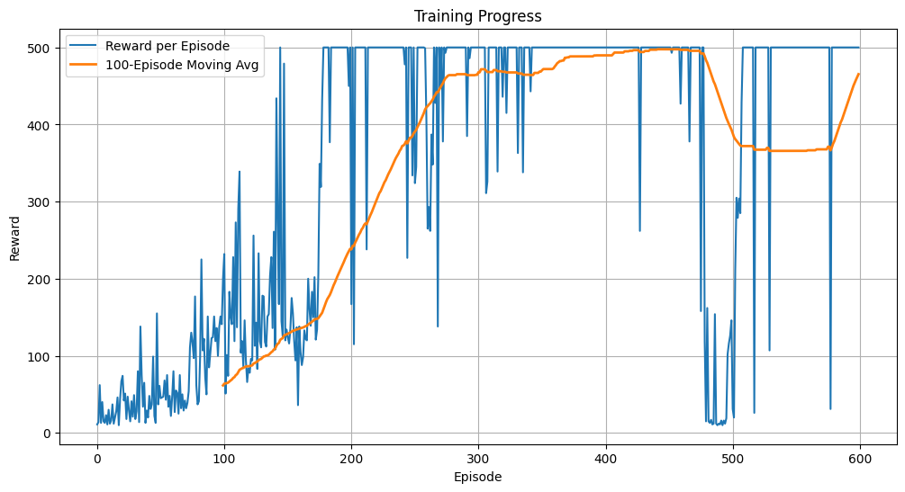
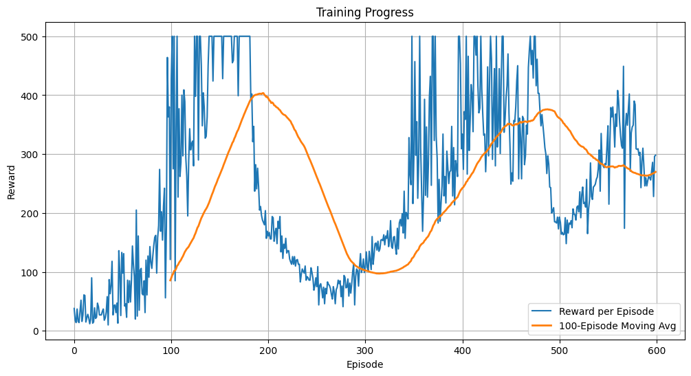

# Deep Reinforcement Learning Laboratory

## Index

- [Exercise 1: REINFORCE Vanilla on CartPole](#exercise-1-reinforce-vanilla-on-cartpole)
- [Exercise 2: REINFORCE with Baseline CartPole](#exercise-2-reinforce-with-baseline-cartpole)
- [Exercise 3: Car Racing OpenAI](#exercise-3-car-racing-openai)

### **Exercise 1: REINFORCE Vanilla CartPole**

To address the CartPole environment, a reimplementation of the REINFORCE algorithm was carried out. REINFORCE is an on-policy method that updates the policy directly based on observed trajectories, without relying on value function estimation. This makes it particularly suitable for introducing the fundamental principles of stochastic policy optimization.

The adopted neural network is a simple feed-forward architecture with two hidden layers of 128 neurons each and ReLU activations. The inputs (position, velocity, pole angle, and angular velocity) are mapped to two logits corresponding to the available actions.
Action selection is performed using a categorical distribution derived from the softmax of the logits, from which actions are sampled stochastically. This approach ensures a good balance between exploration and exploitation and aligns more closely with the probabilistic nature of the REINFORCE algorithm compared to deterministic selection.



The graph shows the trend in the reward obtained per episode during training, together with the moving average over 100 episodes. After an initial phase of gradual learning, the agent achieves high performance around episode 120, with rewards stabilising close to the maximum (500).

However, two significant phases of instability are observed, around episodes 200 and 500, indicating a temporary degradation in performance. These fluctuations are typical of the REINFORCE algorithm, which is sensitive to trajectory variance and the absence of a baseline.


<video width="600" controls>
  <source src="https://raw.githack.com/vincenzocivale/DLA_Laboratorires/main/Esercitazione_2/record/Cart_Pole.mp4" type="video/mp4">
</video>


### **Exercise 2: REINFORCE with Baseline CartPole**

After implementing the vanilla REINFORCE algorithm, one of its main limitations became evident: the high variance in return estimates. To improve training stability, a **value baseline** was introduced. This addition enables the agent to compute a *relative advantage* rather than relying on absolute returns.

Instead of judging actions solely based on the total reward obtained, the agent now considers how much better (or worse) a particular outcome is compared to what was expected from that state. This shift from absolute to contextual evaluation leads to more robust learning.

The implementation relies on two distinct neural networks:

- **Policy Network**: A feed-forward network with two hidden layers (128 units each), outputting logits over the two possible actions.
- **Value Network**: A similarly structured network that outputs a single scalar value representing the estimated value of the state.

```python
class PolicyNet(nn.Module):
    def __init__(self, n_states=4, n_actions=2, n_hidden=128):
        super(PolicyNet, self).__init__()
        self.fc1 = nn.Linear(n_states, n_hidden)
        self.fc2 = nn.Linear(n_hidden, n_hidden)
        self.action_head = nn.Linear(n_hidden, n_actions)

    def forward(self, x):
        x = F.relu(self.fc1(x))
        x = F.relu(self.fc2(x))
        return self.action_head(x)

class ValueNet(nn.Module):
    def __init__(self, n_states=4, n_hidden=128):
        super(ValueNet, self).__init__()
        self.fc1 = nn.Linear(n_states, n_hidden)
        self.fc2 = nn.Linear(n_hidden, n_hidden)
        self.value_head = nn.Linear(n_hidden, 1)

    def forward(self, x):
        x = F.relu(self.fc1(x))
        x = F.relu(self.fc2(x))
        return self.value_head(x)
```

Separate networks were preferred over a shared architecture with two heads, to reduce interference between action selection and state evaluation,  two distinct cognitive tasks that benefit from independent representations.
Learning Mechanism: Advantage Estimation

The policy update is based on the advantage function, computed as:

A(st,at)=Gt−V(st)


Where Gt​ is the total return from time step t, and V(st​) is the value estimated by the value network.
Using this advantage rather than raw returns leads to lower variance and faster convergence.


| Vanilla REINFORCE | REINFORCE con Baseline |
|:-----------------:|:---------------------:|
|  |  |


As shown in the plots, the performance difference between the two approaches:

- **Vanilla REINFORCE** shows high variance in both per-episode rewards and the moving average, requiring more episodes to reach the maximum reward. Learning is noisy and often unstable, with frequent dips and slow improvement.
  
- **REINFORCE with Value Baseline**, on the other hand, displays significantly **faster convergence** and **greater stability**. The moving average increases more smoothly and reaches the performance ceiling (reward = 500) in fewer episodes. The value baseline helps reduce variance by centering the updates around state-specific expectations, resulting in a more efficient learning process.

While both methods eventually achieve high rewards, the baseline-enhanced version learns **faster**, **more reliably**, and **recovers better** from performance drops.


### **Exercise 3: Car Racing OpenAI**

After achieving good results with REINFORCE on CartPole, the transition to CarRacing-v3 represented a significant leap in terms of complexity. Unlike CartPole, where the agent observes a low-dimensional vector state, CarRacing requires the processing of 96×96×3 RGB images to make real-time driving decisions.

The agent was trained on a discretised action space consisting of five macro-actions (no action, left/right turn, acceleration, braking). This choice, inspired by suggestions from [notanymike](https://notanymike.github.io/Solving-CarRacing/), stabilised training, avoiding the noisy updates and divergence observed with continuous actions.

The architecture used is a convolutional neural network with three layers (16 to 64 filters, decreasing kernels), followed by two separate output heads for policy and value estimation, sharing a backbone to extract common visual features.

To improve spatial reasoning, a geometric preprocessing module was added that extracts features such as curvature, proximity to edges, and optimal driving direction, providing structured signals that facilitate learning. Furthermore, to handle temporal dependence, the state includes the last four actions performed (action stacking), introducing a temporal memory that improves control continuity.

Finally, PPO's “clipped” objective function ensured stable and controlled policy updates, preventing catastrophic forgetting and promoting effective convergence despite the high dimensionality of the visual input and the complexity of the task.


Despite various attempts, the results obtained in CarRacing-v3 were disappointing overall. As shown in the video, the agent proceeds very slowly while remaining on the road, highlighting a conservative policy that limits the reward.

<video width="600" controls>
  <source src="https://raw.githubusercontent.com/vincenzocivale/DLA_Laboratorires/main/Esercitazione_2/record/carracing_test_current.mp4" type="video/mp4">
</video>

The main causes may be:

- **Discretised action space**: although it promotes stability, it limits the precision and dynamism of manoeuvres, leading to cautious driving.

- **Difficulty in extracting relevant features**: geometric preprocessing may not be sufficient to ensure adequate visual representations for optimal decisions.

- **Limited temporal abstraction**: using the last four actions as temporal memory may not be sufficient to capture complex and long-term dynamics.

- **Exploration-exploitation balance**: the combination of architecture and PPO may have generated an overly cautious policy, reducing the exploration of more effective strategies.

- **Need for further refinement**: training parameters such as learning rate, batch size, and update frequency may require finer tuning.


