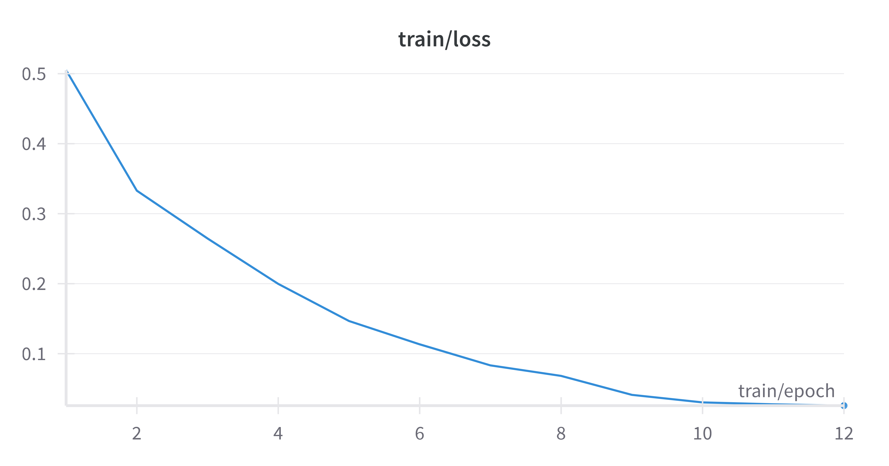
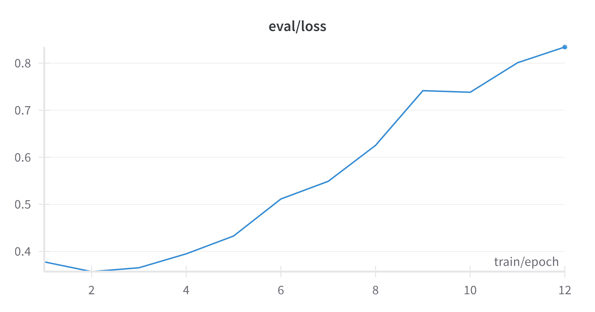

# Deep Learning Applications: Laboratory #3

## Transformers and Foundation Models

This repository contains implementations and experiments for Laboratory #3 of the Deep Learning Applications course. The project explores transformer architectures for Natural Language Processing and Bioinformatics, covering sentiment analysis with BERT/DistilBERT and zero-shot evaluation of single-cell foundation models.

### Project Structure

```
Esercitazione_3/
├── src/                           # Source code modules
│   ├── data/                     # Data handling utilities
│   │   ├── download_spatial_data.py # HuggingFace dataset download
│   │   └── create_dataset.py     # Dataset preprocessing
│   └── model/                    # Model analysis utilities
│       └── analysis.py           # scGPT layer-wise evaluation
├── data/                         # Downloaded datasets
├── results/                      # Experiment results and metrics
├── Lab3_Transformers.ipynb      # Main experiments notebook
└── Readme.md                     # This documentation
```


## Table of Contents

1. [Exercise 1 – Sentiment Analysis with BERT](#exercise-1--sentiment-analysis-with-bert)
2. [Exercise 2 – Fine-tuning DistilBERT](#exercise-2--fine-tuning-distilbert)
3. [Exercise 3 – Zero-Shot Evaluation of Single-Cell Foundation Models](#exercise-3--zero-shot-evaluation-of-single-cell-foundation-models)

### **Exercise 1 – Sentiment Analysis with BERT**

The aim of the exercise was to build a sentiment analysis pipeline using a pre-trained transformer model, specifically DistilBERT, applied to the Rotten Tomatoes dataset provided by Cornell.

The work began with exploring the dataset using the HuggingFace library. The corpus was already divided into three balanced sets (train, validation and test), each consisting of sentences taken from film reviews, annotated with a binary label indicating sentiment (positive or negative). This organisation facilitated the structuring of the model training, optimisation and evaluation process.

#### Implementation Details

Next, the `distilbert-base-uncased` model was loaded along with the associated tokeniser. DistilBERT was chosen for its computational efficiency: it is a lighter and faster version of BERT, obtained through knowledge distillation, which still maintains good performance. The tokeniser uses WordPiece tokenisation, adding the special tokens `[CLS]` and `[SEP]`, and automatically handles padding and attention masks for batch processing.

For each input sequence, the model returns a three-dimensional vector representation in which the first vector (relative to the token `[CLS]`) summarises the meaning of the entire sentence. This representation was used as a sentence-level embedding for each example in the dataset.

Starting from these embeddings, a linear SVM classifier (`LinearSVC`) was trained, thus defining a reference baseline. Performance was evaluated on the validation and test sets using standard classification metrics. The complete implementation can be found in [`Lab3_Transformers.ipynb`](Lab3_Transformers.ipynb).

#### Results

The model achieved an accuracy of 82% on the validation set and 80% on the test set. The F1 scores for the two classes are around 80%, demonstrating good discriminatory power even without fine-tuning the transformer model.

| Dataset            | Metric    | Class 0 | Class 1 | Overall |
| ------------------ | --------- | ------- | ------- | ------- |
| **Validation Set** | Accuracy  | -       | -       | **82%** |
|                    | Precision | 0.81    | 0.84    | -       |
|                    | Recall    | 0.84    | 0.80    | -       |
|                    | F1-score  | 0.83    | 0.82    | -       |
| **Test Set**       | Accuracy  | -       | -       | **80%** |
|                    | Precision | 0.79    | 0.81    | -       |
|                    | Recall    | 0.81    | 0.78    | -       |
|                    | F1-score  | 0.80    | 0.80    | -       |

---

### **Exercise 2 – Fine-tuning DistilBERT**

In this exercise, we perform a complete fine-tuning of the DistilBERT model for the sentiment classification task, going beyond the feature extraction approach used previously.

The dataset is tokenised using the DistilBERT tokeniser with active truncation. The `input_ids` and `attention_mask` fields, which are necessary for training, are obtained. The presence of all required fields (`text`, `label`, `input_ids`, `attention_mask`) in the tokenised datasets is also verified.

`AutoModelForSequenceClassification` is used, which adds a linear classification head (2 classes) to the DistilBERT model. The transformer weights are pre-trained, while the head is randomly initialised.

Training is handled by HuggingFace `Trainer`, with early stopping (patience = 3) and evaluation based on accuracy and F1-score. The main hyperparameters include:

* **Learning rate:** 2e-5
* **Batch size:** 64
* **Epochs:** up to 100
* **Weight decay:** 0.01

Training is end-to-end, updating both the transformer and the head. This approach improves the model's adaptation to the specific task and ensures better performance than simple feature extraction.

The complete fine-tuning implementation is available in [`Lab3_Transformers.ipynb`](Lab3_Transformers.ipynb) with detailed training logs and evaluation metrics.

| Training Loss | Validation Loss |
|:-----------------:|:---------------------:|
|  |  |

It can be observed that after the first training epochs, despite the low loss value, the model begins to overfit, perhaps due to excessive complexity for the task being fine-tuned.

---

### **Exercise 3 – Zero-Shot Evaluation of Single-Cell Foundation Models**

*Exploring Intermediate Layer Embeddings of scGPT on Spatial Transcriptomics Data*

#### Introduction

This project was inspired by the study of Kedzierska et al. (2025) at Microsoft Research, titled ["Zero-shot evaluation reveals limitations of single-cell foundation models"](https://genomebiology.biomedcentral.com/articles/10.1186/s13059-025-03574-x?utm_source=bmc_etoc&utm_medium=email&utm_campaign=CONR_13059_AWA1_GL_DTEC_054CI_TOC-250419#Sec3). Their research showed that prominent single-cell foundation models such as **scGPT** and Geneformer often underperform in zero-shot settings, sometimes failing to surpass simple baseline methods. However, their evaluation was limited to embeddings extracted only from the final output layer of these models.

Motivated by this observation, this work investigates whether embeddings extracted from *intermediate layers* of scGPT might provide richer and more predictive information. This hypothesis is supported by findings in the paper ["Perception Encoder: The best visual embeddings are not at the output of the network"](https://arxiv.org/abs/2504.13181), which suggests that, for certain tasks, the most informative representations reside in inner layers rather than the final output.

A personal literature review did not reveal other studies investigating intermediate-layer embeddings of foundation models in single-cell genomics, highlighting the novelty of this analysis.


#### Data and Model

Due to the unavailability of the original datasets used in the reference study ([Assistance Request for Accessing Complete Datasets #3](https://github.com/microsoft/zero-shot-scfoundation/issues/3)), this project uses the publicly available [TCGA digital spatial transcriptomics](https://huggingface.co/datasets/nonchev/TCGA_digitalspatial_transcriptomics) dataset from Hugging Face Datasets. This dataset contains spatial transcriptomics data: gene expression values (RNA levels) for thousands of genes measured at spatially resolved spots in tissue samples, along with their XY coordinates.

The scGPT model, hosted on Hugging Face Hub ([tdc/scGPT](https://huggingface.co/tdc/scGPT)), serves as the foundation model. It was chosen because of its relevance in the field and its role in the reference article.

Data downloading and preprocessing utilities are implemented in [`src/data/download_spatial_data.py`](src/data/download_spatial_data.py) and [`src/data/create_dataset.py`](src/data/create_dataset.py).

#### Methodology

The core of the analysis consists of extracting embeddings from *each* of the twelve Transformer encoder layers within scGPT, without modifying the model architecture or weights. The procedure is as follows:

1. The input gene expression data (gene IDs + values) is encoded into a 512-dimensional vector by the model’s gene and value encoders.
2. This vector sequentially passes through the twelve TransformerEncoderLayers.
3. The output embedding from each layer is saved.
4. The model’s pre-trained expression decoding head is applied to project these 512-dimensional embeddings into scalar values, representing predicted gene expression.
5. Predictions are compared to true gene expression using metrics such as Mean Squared Error (MSE) and Mean Absolute Error (MAE), restricted to genes actively expressed (excluding padding).
6. A simple baseline prediction is computed using the average expression value per cell.

This setup allows a layer-wise, zero-shot evaluation of the model’s intrinsic representational power.

#### Results 

The evaluation confirms the original article’s conclusion that all transformer layers perform worse than the simple average-expression baseline when predicting gene expression in this zero-shot setting.

However, a critical new finding is that **intermediate layers can outperform the final layer**: for example, the second Transformer block’s embedding yields an MSE of 30.2 compared to 381.0 for the last layer, indicating richer predictive information early in the network. This underscores the importance of multi-layer analysis to understand model behavior and representation quality.


The following table reports the main evaluation metrics (MSE, MAE, Pearson correlation) for each Transformer layer output compared to a simple mean baseline. Full results, including standard deviations, are available in [`data/result/scgpt_layerwise_evaluation.csv`](results/scgpt_layerwise_evaluation.csv).

| Layer                | MSE Mean    | MAE Mean   |
| -------------------- | ----------- | ---------- |
| Transformer Layer 0  | 42.8374     | 6.4056     |
| Transformer Layer 1  | **30.2377** | **5.3947** |
| Transformer Layer 2  | 30.8693     | 5.4469     |
| Transformer Layer 3  | 36.0490     | 5.9255     |
| Transformer Layer 4  | 64.7740     | 8.0070     |
| Transformer Layer 5  | 108.6514    | 10.3867    |
| Transformer Layer 6  | 102.0115    | 10.0561    |
| Transformer Layer 7  | 72.9351     | 8.4405     |
| Transformer Layer 8  | 85.7650     | 9.0805     |
| Transformer Layer 9  | 195.4080    | 13.8542    |
| Transformer Layer 10 | 450.0759    | 21.1728    |
| Transformer Layer 11 | 381.0563    | 19.5018    |

**Note**:

* The lowest MSE and MAE are achieved by the simple **mean baseline**.
* Among model layers, **Transformer Layer 1 and Layer 2** provide the best performance, with MSE ≈ 30.2–30.8, far better than the final layer (Layer 11).
* Deeper layers show degradation in performance, confirming findings from the reference paper.

#### Future Developments

Several directions could be explored to improve and extend this analysis:

* **Dataset Alignment**: For an optimal comparison with the original study ("Zero-shot evaluation reveals limitations of single-cell foundation models"), it would be essential to re-run this evaluation using the same datasets employed by the authors. Unfortunately, these datasets are currently unavailable to the public.

* **Model Comparison**: Extending the evaluation to other single-cell foundation models, such as Geneformer, could help generalize the findings and better assess whether the observed limitations are specific to scGPT or more broadly applicable.

* **Embedding Combination Strategies**: Investigating more sophisticated methods for combining embeddings from different layers (e.g., weighted sums, learned combinations) might improve performance. In this work, a simple mean of embeddings from multiple layers was tested but led to degraded performance compared to the best single-layer results.

